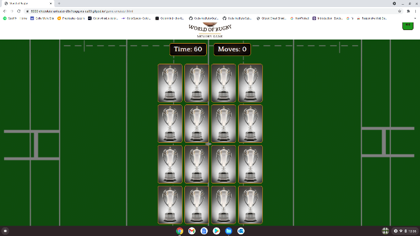
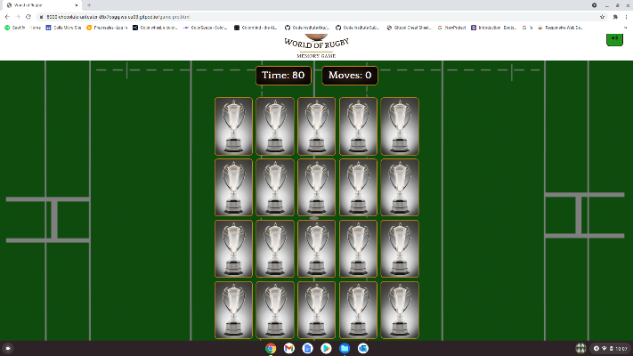
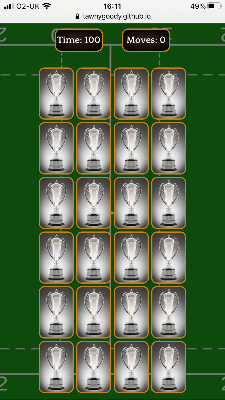

<h1 align="center">World of Rugby Memory Game</h1>

View the repository in GitHub [here](https://github.com/Tawnygoody/MS2-World-of-Rugby)

View the live project [here](https://tawnygoody.github.io/MS2-World-of-Rugby/)

# Contents

- [User Experience (UX)](#user-experience-(ux))
    - [Strategy](#strategy)
    - [Scope](#scope)
    - [Structure](#structure)
    - [Skeleton](#skeleton)
    - [Surface](#surface)
- [Technologies Used](#technologies-used)
    - [Languages Used](#languages-used)
    - [Frameworks, Libraries & Programmes used](#frameworks-libraries-and-programmes-used)
- [Testing](#testing)
    - [W3C Validator](#w3c-validator)
    - [Testing User Stories](#testing-user-stories)
    - [Full Testing](#full-testing)
    - [Further Testing](#further-testing)
        - [Browser Compatibility](#browser-compatibility)
        - [Responsive Design](#responsive-design)
    - [Solved Bugs](#solved-bugs)
    - [Known Bugs](#known-bugs)
    - [Lighthouse](#lighthouse)
- [Deployment](#deployment)
    - [GitHub Pages](#github-pages)
    - [Forking the GitHub Repository](#forking-the-github-repository)
    - [Making a Local Clone](#making-a-local-clone)
- [Credits](#credits)
    - [Code](#code)
    - [Media](#media)
        - [Images](#images)
        - [Audio](#audio)
    - [Acknowledgements](#acknowledgements)

# User Experience (UX)

## Strategy

The main requirement of this project was to create a fun, easy to play, interactive memory game 
that could be enjoyed by everyone. As the content of the game is suitable for all age groups, the target
audience is substantial. The game may appeal more to sports fans, and more specifically rugby fans. 

### User Stories
- #### Business Goals
    - The game needs to be easily accessible and straightforward to use, through the use of readily 
    available instructions. 
    - The game needs to engaging from the first visit to encourage the user to play the game. 
    - The game needs to appeal to all ages to maximise the target audience.
    - Scrolling whilst playing the game on different screen sizes should be minimal, as this will
    detract from the user experience. 

- #### User Goals
    - I want to know what the website offers, and easily navigate through the site. 
    - I want to be able to return to the home page at the click of a button. 
    - I want to be able to challenge myself with different difficulty settings. 
    - I want to have the option of turning audio on and off. 
    - I want a game that is simple to play so I do not need to spend a length of time learning the rules.  
    - I want to see a scoring system so I have a score to beat. 
    - I want to be able to contact the business with any queries I may have. 

## Scope

Based on the strategic goals established, I will incorporate a phased approach prioritising the most feasible
concepts. 

The first phase will be aimed at creating a minimum viable product (MVP):

- ### Phase 1
    - A home page, with a stimulating image, logo, and button to open a modal.
    - Modal to include, instructions, contact information, and option to begin a new game. 
    - A game page with the layout of the cards all with the same image, until the game begins and the user 
    flips cards. 
    - A timer on the game page, which counts down when the game has begun. 
    - A scoring system should be displayed to reflect the user's performance based on the number of moves made.
    - A congratulations / commiserations modal should show time, score and the option to play again. 

Once the MVP has been established I would add to the user experience in phase 2:

- ### Phase 2
    - Include different levels of difficulty to challenge the user. 
    - Incorporate EmailJS API to receive emails from the user using a contact form.  
    - Include a leader board using local storage so a user can save their scores in the session, and compete against default
    scores that will already appear on the leader board. 

I would then implement back end technologies (knowledge not yet gained)

- ### Phase 3
    - Include a leader board that would save the scores to a database, so that users could compete against
    other users.

## Structure
- ### Design
    - #### Colour Scheme
        - The main colours for the website are Brown and Rusty colours. These have been picked from the logo Image
        to compliment the website. White and yellow have been used for the text in places to increase colour contrast and 
        allow easier readability. 
            - #312018 & #c8831b have been picked from the logo and have been used throughout the site. 
            - #1c961b has been picked from the game page background image, when no dark overlay has been applied, and has been used to style the audio button.
            - #fff & #fbf41d have been used to increase readibility.           
    - #### Typography
        - Quattrocento will be used for headings and titles and Radley will be used for the content of the website. San-serif will 
        be used as a fallback, should there be an error with the imported fonts. These fonts are in keeping with the websites
        logo. 
        - The text will be consistent across all pages / modals. Most content can be centred as there are no large bodies of 
        text on the website. 
    - #### Imagery
        - Home page background is designed to catch the user's attention. This must be striking and directly 
        related to what the company offers. 
        - Game page background must be in keeping with the game, but should not detract from the game cards or distract the user. 
        - All images must be of sound enough quality, so they can scale according to different device sizes, without pixelating.
    - #### Audio 
        - On the game page the user has the option to turn on sound effects. The background music is used during the Rugby World Cup, so is in keeping with 
        what the website is offering. 
        - In game audio (flip sound & match sound) can be heard over the background music and does not get drowned out. 
        - Victory / game over audio adds further to the user experience. 

    
## Skeleton
Below you can find links for my wireframes based on Phase 1 (established within the scope), showing how I would 
like the pages to be structured, and how the site would appear on different device sizes. 

### Wireframes 
The wireframes have been created using Wondershare Mockitt, and show for desktop, iPad & iPhone 11 Pro/X.
- #### Home Page
    - [Desktop](documentation/wireframes/home-page-wireframe-desktop.png)
    - [iPad](documentation/wireframes/home-page-wireframe-ipad.png)
    - [iPhone](documentation/wireframes/home-page-wireframe-iphone.png)
- #### Home Page Modal
    - [Desktop](documentation/wireframes/home-modal-desktop.png)
    - [iPad](documentation/wireframes/home-modal-ipad.png)
    - [iPhone](documentation/wireframes/home-modal-iphone.png)
- #### Game Page
    - [Desktop](documentation/wireframes/game-page-desktop.png)
    - [iPad](documentation/wireframes/game-page-ipad.png)
    - [iPhone](documentation/wireframes/game-page-iphone.png)
- #### Game Page Modal 
    - [Desktop](documentation/wireframes/game-modal-desktop.png)
    - [iPad](documentation/wireframes/game-modal-ipad.png)
    - [iPhone](documentation/wireframes/game-modal-iphone.png)

### Modifications
As the project progressed and I looked to implement Phase 2 concepts (established within the scope), there have been 
a variety of changes made: 

- Audio has been removed from the home page as I did not feel it was necessary. 
- A footer has been added with links to GitHub and Linkedin. 
- Kick Off modal has three buttons with dropdowns for "Rules" and "Contact Us" sections, to minimise unnecessary information 
and increase user interactivity. 
- Difficulty modal has been added to the home page, so the user can select the difficulty of the game.
- A Leader Board modal has been added to the game pages, so user's can compete against themselves and the default high scores. 
- A variety of styling changes have been made to improve the aesthetics and user experience.  

Although there have been several changes, I feel the planning at the beginning of the project meant these changes 
could be applied very easily. 

## Surface
- ### Features
    - #### All Pages
        - Logo - The logo row will include an image of the websites logo, which slides down when the page has loaded.
        - Footer - The footer will contain links to the GitHub repository and Linkedin which will open in a separate tab. 
    - #### Home Page
        - Striking background image to engage the user. 
        - Kick Off button which triggers the World of Rugby Modal. 
    - #### World of Rugby Modal
        - Rules button slides open the rules for the game when clicked, and hides them when clicked again. 
        - New Game button takes the user to select their difficulty modal. 
        - Contact Us button which slides open the contact form when clicked, and hides the contact form when clicked again.
        Submitting the contact form once the fields have been completed, will trigger an EmailJS API and send an email to the
        developer.  
    - #### Difficulty Modal
        - 3 buttons for choosing a difficulty which will direct the user to that game page depending on their selection. 
        - The "Back" button will take the user back to the World of Rugby Modal. 
    - #### Game Pages
        - Kick Off overlay is removed once the user has clicked anywhere on the screen, so the game can begin. 
        - Message on the Kick Off overlay to tell the user to turn their device to portrait mode, as this will provide the best user experience. This message will only 
        show on devices that are less than 1025px wide. This width has been chosen as it is the width of an iPad in landscape mode. 
        - Darkened background image so that the game cards stand out. 
        - Depending on which selection the user makes the game page will display 16, 20, or 25 cards. The remaining features are the same. 
        - Audio button in the logo row which when clicked will allow sound effects. If the user clicks again the sound effects will stop. 
        - If the audio is on, and flip sound effect will play when a card is clicked and a match sound effect will play if the user matches 
        two cards. 
        - Game information row displays the time remaining and the moves the user has made. 
        - Game container contains all the cards the user will click to play the game. 
    - #### Game Page modals
        - ##### All Game Page modals
            - Play Again button allowing the user to play the game again. 
            - Home Button to take the user back to the website's homepage.    
        - ##### Victory Modal
            - A victory sound effect will be played when the victory modal opens.
            - A dancing animation of a trophy is displayed to symbolise victory.
            - The modal will show the users score calculated in the javascript file, the time remaining and the total moves the user has made. 
            - A star rating system will also display depending on how many moves the user has made. 
            - A Name input field will allow the user to save their score to the leaderboard. The user can only save their score once the name field
            has been filled out. 
        - ##### Game Over Modal 
            - A game over sound effect will be played when the victory modal pens. 
            - A dancing animation of a rugby tackle is displayed to symbolise the game is over.
        - ##### Leader Board Modal
            - Leader Board will display the 10 default scores set in the game-script, and will display the user's score, and sort it against the 
            default scores and any previously saved scores. Only the top 15 scores will be displayed. 
            - Leader Board reset button will clear the local storage and take the user to the home screen. A confirmation message will alert the user
            before the local storage is cleared. 

### Personal Reflections
Overall I am very happy with the outcome of the project. I have been able to implement both Phase 1 & Phase 2 concepts to the final site. 
As I further increase my knowledge of Javascript, rather than having 3 different game pages for the different difficulty levels, I could use Javascript to build
the layout dependant on the difficulty selected. 

# Technologies Used

## Languages used
- [HTML](https://en.wikipedia.org/wiki/HTML5)
- [CSS](https://en.wikipedia.org/wiki/Cascading_Style_Sheets) 
- [JavaScript](https://en.wikipedia.org/wiki/JavaScript)  

## Frameworks Libraries and Programmes used
- [jQuery](https://jquery.com/)
    - jQuery has been used for adding effects and toggling modals. 
- [Bootstrap 4.3.1](https://getbootstrap.com/docs/4.3/getting-started/introduction/)
    - Used as a framework for styling and to make the website responsive.
- [Hover.css](https://ianlunn.github.io/Hover/)
    - Hover.css has been used for the buttons and social media icons. 
- [Google fonts](https://fonts.google.com/)
    - Google fonts has been used to import "Quattrocento" and "Radley" fonts used across the website. 
- [Fontawesome](https://fontawesome.com/icons?d=gallery)
    - Font awesome has been used for the GitHub and Linkedin icons in the footer. 
- [Google Developer Tools](https://developers.google.com/web/tools)
    - Google developer tools have been used to fix bugs, and test responsiveness and website performance. 
- [Github](https://github.com/)
    - GitHub is used to store the project code after being pushed from Git.
- [Git](https://git-scm.com/) 
    - Git was used for version control by utilizing the Gitpod terminal to commit to Git and Push to GitHub.
- [Techsini](https://techsini.com/multi-mockup/)
    - Techsini has been used to generate mock images on different devices, and help with responsiveness. 
- [Canva](https://www.canva.com/)
    - Canva has been used to design the websites logo. 
- [Wondershare Mockitt](https://mockitt.wondershare.com/)
    - This has been used to create the wireframes for the project. 
- [Reduces Images](https://www.reduceimages.com/)
    - This has been used to re-size the images. 
- [Freeconvert](https://www.freeconvert.com/wav-compressor/download)
    - This has been used to re-size the audio files.
- [Removebg](https://www.remove.bg/)
    - This has been used to remove the background colour on images for the victory and gameover modals. 
- [LambdaTest](https://www.lambdatest.com/)
    - LambdaTest has been used to test the website on different browsers.
- [Screencastify](https://www.screencastify.com/)
    - Screencastify has been used to record and edit the website in action for the README.
- [CloudConvert](https://cloudconvert.com/mp4-to-gif) 
    - This has been used to convert screen recordings into gif format for the README.
- [Grammarly](https://app.grammarly.com/ddocs/1040510993) 
    - This has been used across the website to fix spelling errors and grammar.
- [Favicon Generator](https://favicon.io/favicon-converter/)
    - This has been used to generate a favicon image for the website tab.

# Testing

## W3C Validator

- W3C CSS Validator
    - [style.css results](documentation/testing/w3c/w3c-css.png)

- W3C Markup Validator
    - [index.html results](documentation/testing/w3c/w3c-index.png)
    - [game-amateur.html results](documentation/testing/w3c/w3c-amateur.png)
    - [game-pro.html results](documentation/testing/w3c/w3c-pro.png)
    - [game-leg.html results](documentation/testing/w3c/w3c-leg.png)

- JSHint
    - [script.js](documentation/testing/w3c/js-script.png)
    - [game-script.js](documentation/testing/w3c/jshint-game-script.png)

No warning messages within the script.js. emailjs is listed as an undefined variable, and sendMail is listed as an unused variable, however this is a function. 

The only warning in the game-script was to do with only being available in ES6. 

## Testing User stories

### Business Goals
#### The game needs to be easily accessible and straightforward to use, through the use of readily available instructions.
- The home page only has only the Kick Off button in its main content, allowing for easy accessibility. 
- The Kick Off modal has three buttons. When the rules button is clicked once this drops down the rules of the game for the user. 

#### The game needs to be engaging from the first visit to encourage the user to play the game. 
- The user is immediately greeted with a striking image directly related to rugby, to draw the user in. 
- All the buttons are designed to be eye-catching to encourage the user to interact with the website. 
- The use of modals means the user isn't directed to a different page, so there is less loading time between interactions. 

#### The game needs to appeal to all ages to maximise the target audience.
- All content is appropriate that all users can enjoy playing the game. 
- With around 90% of the population using smartphones, the game can be used by people of all ages. The buttons and game cards 
are of an appropriate size that all users can interact with the game. 

#### Scrolling whilst playing the game on different screen sizes should be minimal, as this will detract from the user experience.
- The styling of the website ensures that on the majority of devices there is no scrolling required when playing the game as all game cards 
are visible. Some smaller devices may require some minor scrolling, especially when playing on the higher difficulties. 

  

### User Goals

#### I want to know what the website offers, and easily navigate through the site.
- The user is greeted on all pages with a logo showing that the website is some form of memory game. 
- Upon opening the Kick Off modal the user is met with a welcome message. 
- The purposefully limited options means the site is easy to navigate through.

 

#### I want to be able to return to the home page at the click of a button. 
- The user can return to the home page when none of the modals are open by clicking the logo. 
- When the Kick Off or Difficulty modals are open the user can return to the home page by clicking outside the modals. 
- When the game page modals are open the user can click the home button to take them back to the home page. 

#### I want to be able to challenge myself with different difficulty settings. 
- The user has the option to select three different difficulties: Amateur - 16 cards, Professional - 20 cards, or Legend - 24 cards.
- The user is directed to a different page depending on the difficulty they select. 

#### I want to have the option of turning audio on and off. 
- The game by default will have all sound effects muted. 
- The "volume up" icon will display when no sound effects are playing, indicating to the user to press this should they wish to hear audio. 
- The "volume mute" icon will display when sound effects are playing, indicating to the user to press this should they wish to mute the audio. 

 

#### I want a game that is simple to play so I do not to spend a length of time learning the rules. 
- Memory games by design are relatively straightforward to understand. "Rules" is the first button the user will see when opening the Kick Off modal, 
with a brief description the user is immediately aware of how the game is played. 

 
#### I want to see a scoring system so I have a score to beat. 
- When the user has matched all the cards they are met with a victory modal. The user is provided with the stats of their game: 
    - User is shown how much time remaining they had once all cards are matched. 
    - User is shown the total moves they made to match all the cards. 
    - User is shown a star rating system based on their performance. 
    - User is shown their score, which is calculated by adding the time remaining, to the points scored based on the moves made. 
- User can save their score to a local leader board, with some default high scores already set, to challenge themselves to reach the top of the leader board. 
- User is also able to clear the leader board and reset it to the default scores. 

Please note the image below does not show the warning message when clearing the leader board due to the screen recording programme used. 

#### I want to be able to contact the business with any queries I may have.
- The user has the option of selecting the contact us button on the Kick Off modal, which drops down a contact form when clicked. 
- All 3 fields must be completed, which will send an automated email to the developer. 
- The user is greeted with a thank you for your enquiry message, and the contact form is hidden.
- When the user opens the contact form again, the form has been cleared. 

Please note the image below does not show the "thankyou for your enquiry" message due to the screen recording programme used.

## Full Testing

Testing was completed using the following steps on all interactive elements of the website [View here](TESTING.md)

## Further Testing
### Browser Compatibility

LambdaTest has been used to test the website across different browsers:

#### Laptop / Desktop
- Google Chrome - successful
- Mozilla Firefox 81 - successful
- Safari 12 - successful
- Edge 85 - successful
- Opera 70 - successful
- Internet Explorer 11 failed to meet the needs of the website. This can be seen below: 

On the home page, the Kick Off button would not fade in and the logo would not slide down on page load. The logo has also been squeezed down 
so is scaling incorrectly. 

The back button in the modal footer of the difficulty modal is off centre. 

On the game pages, the Logo remains squeezed, the audio has not been centred in the logo bar, the time and moves counter are off-centre, and the overlay
text does not get removed when it is clicked therefore the user cannot play the game. 

Although this is a problem when using Internet Explorer (IE), IE is gradually being replaced by Microsoft Edge, which fully supports the website. 

#### iPad 8th Generation
- Google Chrome - successful
- Safari - successful

#### iPhone 8
- Google Chrome - successful
- Safari - successful

#### EmailJS
Test emails from all browsers working correctly:
- [Google Chrome](documentation/testing/browser/bc-chrome.png)
- [Mozilla Firefox 81](documentation/testing/browser/bc-firefox.png)
- [Safari 12](documentation/testing/browser/bc-safari.png)
- [Edge 85](documentation/testing/browser/bc-edge.png)
- [Opera 70](documentation/testing/browser/bc-opera.png)
- [Internet Explorer 11](documentation/testing/browser/bc-ie.png)

### Responsive Design

#### Google Developer Tools

Google Developer tools were used throughout the project to test the responsiveness of the website across multiple device sizes. 
I have used Google Developer tools to simulate the following device sizes:

##### Home Page
- Galaxy Fold: [Portrait](documentation/testing/responsiveness/home/galaxy-fold-home-p.png), [Landscape](documentation/testing/responsiveness/home/galaxy-fold-home-l.png)
- Galaxy S5: [Portrait](documentation/testing/responsiveness/home/galaxys5-p.png), [Landscape](documentation/testing/responsiveness/home/galaxys5-l.png)
- Iphone 4: [Portrait](documentation/testing/responsiveness/home/iphone4-p.png), [Landscape](documentation/testing/responsiveness/home/iphone4-l.png)
- Iphone 5/SE: [Portrait](documentation/testing/responsiveness/home/iphone5-p.png), [Landscape](documentation/testing/responsiveness/home/iphone5-l.png)
- Iphone 6/7/8: [Portrait](documentation/testing/responsiveness/home/iphone6-p.png), [Landscape](documentation/testing/responsiveness/home/iphone6-l.png)
- Iphone X: [Portrait](documentation/testing/responsiveness/home/iphonex-p.png), [Landscape](documentation/testing/responsiveness/home/iphonex-l.png)
- Ipad: [Portrait](documentation/testing/responsiveness/home/ipad-p.png), [Landscape](documentation/testing/responsiveness/home/ipad-l.png)
- Moto G4: [Portrait](documentation/testing/responsiveness/home/motog4-p.png), [Landscape](documentation/testing/responsiveness/home/motog4-l.png)
- Pixel 2: [Portrait](documentation/testing/responsiveness/home/pixel2-p.png), [Landscape](documentation/testing/responsiveness/home/pixel2-l.png)
- Surface Duo: [Portrait](documentation/testing/responsiveness/home/surface-p.png), [Landscape](documentation/testing/responsiveness/home/surface-1.png)

##### Amateur Game Page
As the game is optimized for playing in a portrait orientation, I have focused on laying out the cards so that minimal scrolling is required
when a handheld device is in portrait orientation. 

- Galaxy Fold: [Portrait](documentation/testing/responsiveness/amateur/am-galaxy-fold-p.png), [Landscape](documentation/testing/responsiveness/amateur/am-galaxy-fold-l.png)
- Galaxy S5: [Portrait](documentation/testing/responsiveness/amateur/am-galaxys5-p.png), [Landscape](documentation/testing/responsiveness/amateur/am-galaxys5-l.png)
- Iphone 4: [Portrait](documentation/testing/responsiveness/amateur/am-iphone4-p.png), [Landscape](documentation/testing/responsiveness/amateur/am-iphone4-l.png)
- Iphone 5/SE: [Portrait](documentation/testing/responsiveness/amateur/am-iphone-5-p.png), [Landscape](documentation/testing/responsiveness/amateur/am-iphone-5-l.png)
- Iphone 6/7/8: [Portrait](documentation/testing/responsiveness/amateur/am-iphone6-p.png), [Landscape](documentation/testing/responsiveness/amateur/am-iphone6-l.png)
- Iphone X: [Portrait](documentation/testing/responsiveness/amateur/am-iphonex-p.png), [Landscape](documentation/testing/responsiveness/amateur/am-iphonex-l.png)
- Ipad: [Portrait](documentation/testing/responsiveness/amateur/am-ipad-p.png), [Landscape](documentation/testing/responsiveness/amateur/am-ipad-l.png)
- Moto G4: [Portrait](documentation/testing/responsiveness/amateur/am-motog4-p.png), [Landscape](documentation/testing/responsiveness/amateur/am-motog4-l.png)
- Pixel 2: [Portrait](documentation/testing/responsiveness/amateur/am-pixel2-p.png), [Landscape](documentation/testing/responsiveness/amateur/am-pixel2-l.png)
- Surface Duo: [Portrait](documentation/testing/responsiveness/amateur/am-surface-p.png), [Landscape](documentation/testing/responsiveness/amateur/am-surface-l.png)

All devices show all the game cards, the timer and moves counter within the viewport height, therefore the user does not need to scroll when playing the game. 

##### Professional Game Page
- Galaxy Fold: [Portrait](documentation/testing/responsiveness/pro/pr-galaxy-fold-p.png), [Landscape](documentation/testing/responsiveness/pro/pr-galaxy-fold-l.png)
- Galaxy S5: [Portrait](documentation/testing/responsiveness/pro/pr-galaxys5-p.png), [Landscape](documentation/testing/responsiveness/pro/pr-galaxys5-l.png)
- Iphone 4: [Portrait](documentation/testing/responsiveness/pro/pr-iphone4-p.png), [Landscape](documentation/testing/responsiveness/pro/pr-iphone4-l.png)
- Iphone 5/SE: [Portrait](documentation/testing/responsiveness/pro/pr-iphone5-p.png), [Landscape](documentation/testing/responsiveness/pro/pr-iphone5-l.png)
- Iphone 6/7/8: [Portrait](documentation/testing/responsiveness/pro/pr-iphone6-p.png), [Landscape](documentation/testing/responsiveness/pro/pr-iphone6-l.png)
- Iphone X: [Portrait](documentation/testing/responsiveness/pro/pr-iphonex-p.png), [Landscape](documentation/testing/responsiveness/pro/pr-iphonex-l.png)
- Ipad: [Portrait](documentation/testing/responsiveness/pro/pr-ipad-p.png), [Landscape](documentation/testing/responsiveness/pro/pr-ipad-l.png)
- Moto G4: [Portrait](documentation/testing/responsiveness/pro/pr-motog4-p.png), [Landscape](documentation/testing/responsiveness/pro/pr-motog4-l.png)
- Pixel 2: [Portrait](documentation/testing/responsiveness/pro/pr-pixel2-p.png), [Landscape](documentation/testing/responsiveness/pro/pr-pixel2-l.png)
- Surface Duo: [Portrait](documentation/testing/responsiveness/pro/pr-surface-p.png), [Landscape](documentation/testing/responsiveness/pro/pr-surface-l.png)

Devices with a small viewport height (eg iphone4), do not show the timer or the moves counter. However all devices still show all the game cards, therefore the user does not need to scroll 
when playing the game unless they wish to view the timer or moves counter on smaller devices. 

##### Legend Game Page
- Galaxy Fold: [Portrait](documentation/testing/responsiveness/legend/le-galaxy-fold-p.png), [Landscape](documentation/testing/responsiveness/legend/le-galaxy-fold-l.png)
- Galaxy S5: [Portrait](documentation/testing/responsiveness/legend/le-galaxys5-p.png), [Landscape](documentation/testing/responsiveness/legend/le-galaxys5-l.png)
- Iphone 4: [Portrait](documentation/testing/responsiveness/legend/le-iphone4-p.png), [Landscape](documentation/testing/responsiveness/legend/le-iphone4-l.png)
- Iphone 5/SE: [Portrait](documentation/testing/responsiveness/legend/le-iphone5-p.png), [Landscape](documentation/testing/responsiveness/legend/le-iphone5-l.png)
- Iphone 6/7/8: [Portrait](documentation/testing/responsiveness/legend/le-iphone6-p.png), [Landscape](documentation/testing/responsiveness/legend/le-iphone6-l.png)
- Iphone X: [Portrait](documentation/testing/responsiveness/legend/le-iphonex-p.png), [Landscape](documentation/testing/responsiveness/legend/le-iphonex-l.png)
- Ipad: [Portrait](documentation/testing/responsiveness/legend/le-ipad-p.png), [Landscape](documentation/testing/responsiveness/legend/le-ipad-l.png)
- Moto G4: [Portrait](documentation/testing/responsiveness/legend/le-motog4-p.png), [Landscape](documentation/testing/responsiveness/legend/le-motog4-l.png)
- Pixel 2: [Portrait](documentation/testing/responsiveness/legend/le-pixel2-p.png), [Landscape](documentation/testing/responsiveness/legend/le-pixel2-l.png)
- Surface Duo: [Portrait](documentation/testing/responsiveness/legend/le-surface-p.png), [Landscape](documentation/testing/responsiveness/legend/le-surface-l.png)

There are a few more devices where the timer and moves counter aren't visible when showing all the game cards and on some of the smaller devices, minimal scrolling is required 
to see all the game cards. I could make the game cards smaller to accommodate the smaller devices, however, I feel making the images any smaller, would not make them clear enough, 
and may detract from the user experience as the cards would be very small to click. Therefore I'm happy to allow for a small amount of scrolling. 

#### Manual Device Testing

Manual device testing was carried out on iPhone 8, iPad 8th Generation, Acer Chromebook and LG 22 inch desktop monitor. Images appear in order from left to right and top to bottom. 

##### Home Page

  

##### Game Page Overlay

  

##### Amateur Game Page

  

##### Professional Game Page

  

##### Legend Game Page

  

## Solved Bugs
1. I had an issue when it came to adding difficulty levels to the game and changing the value
of variables depending on what game type was selected. One solution would have been to create different
scripts for each game page, however, I did not feel this was a practical solution, and there would be a 
better way of doing this. 
    - Fix: After some research, I found a solution on Stack Overflow (seen in credits section), which selects the difficulty based on the window.location.pathname
    (i.e the HTML page). I found this was the best solution for my site as I had already created 3 HTML pages for the 3 different game difficulties. 
    - Issue: I did have one issue, to begin with when using this approach. The start time on every page would display as "NAN", once the first card was 
    clicked and the game had begun. 
    - Fix: A tutor at code institute (Stephen) had pointed out to me that javascript loads on the page from the top down. As the "timeRemaining = startTime" variable
    was located above the startTime dependant on difficulty, this was causing the error. A simple re-arrangement of the code fixed this issue. 
2. When the game victory / game over modal was displayed, if the user clicked outside the area of the modal the modal would close. This meant that the game 
would not restart and the only way the user could play again would be to click on the logo to take the user back to the home page or refresh the page. I felt that this was not a 
good user experience. 
    - Fix: I found the solution on Stack Overflow (seen in credits section), which adds 'data-backdrop="static" data-keyboard="false"' to the modal. The user can then click
    outside the modal and this will not close the modal. The user then has the option to play the game again or return home. 
3. I wanted the user to be able to reset the leaderboard should they wish. There wasn't an issue with this as I could just use localStorage.clear(). However, there was
no indication to the user that this had been achieved without reloading the page manually. Also, I felt this button could be pressed accidentally, in which case the user
would lose any saved progress they had made. 
    - Fix: I found the solution on Stack Overflow (seen in credits section), which would prompt the user with an alert, letting them know that they are about to clear the 
    leader board and all saved progress would be lost. I also redirected the user back to the home page if they confirmed this, showing a clear indication that re-setting
    the leader board had been achieved. 
4. I had an issue with the modal content, particularly on smaller devices. When the modal content was taller than the height of the device, it wouldn't scroll. For example, the user 
would not be able to fill out the contact form on the home page modal. 
    - Fix: I found the solution on Stack Overflow (seen in the credit section), which set the overflow-y: auto, so the content would then be scrollable. 
5. When I first decided to implement a leader board into the game, the first approach I took was to create a list of default scores in the HTML doc. However, once I 
had written the code to save the players high scores with the help of a tutorial (seen in the credits section), I was unable to sort the players high scores with 
the default scores written in the HTML doc. 
    - Fix: Rather than write the default scores in HTML, I created an array of objects with the default high scores, and rather than having an empty array for the highScores variable
    set this to the defHighScores array of objects. This, therefore, sorted the default scores and any high scores the user has saved in the saveHighScores event. 
6. I had a small issue when it came to retrieving the user's final score. I had wanted the user's final score to equal the points (dependant on moves made) plus the 
time remaining once the user had won the game. However, the score was displaying as them joined together rather than them being added to each other. For example, if the points scored were 
60 and the time remaining was 15, this would show as 6015 rather than 75. 
    - Fix: I found the solution on Stack Overflow (seen in credits section), which uses a parseInt function that parses a string and returns an integer, so the two values could then 
    be added to each other. 
7. After deploying the website and testing on iPad and iPhone when I tried to clear the leaderboard (i.e removeStorage function) 
when you clicked ok on the warning message it would clear the local storage, however instead of directing the user to the home page, a 404 
message appeared. 
    - Fix: After some trial and error I found the error seemed to stem from using "window.location.assign("/")". I have replaced this with 
    "window.location.href = 'index.html'". The user is now directed back to the home page once the leader board has been cleared on all manual devices
    tested. 
8. When testing the site on iPhone / iPads Safari browser, the game cards would flip when clicked but would only show the back face image. The user 
could not see the team logo. 
    - I have run style.css through Autoprefixer and this has corrected the problem. 
9. When testing the site on iPad manually, the "Please turn your device to portrait" message does not show on the iPad when in landscape mode. 
    - Fix: As google developer tools may be using an older version iPad, I have increased the max-width to 1200px for the message to show. Message now shows
    on the iPad during manual testing. 
10. When testing the site on iPhone the icon inside the audio button was off-centre. The icon would overlap the edge of the button. 
    - Fix: After checking google developer tools, it appeared there was some default padding set to the button, which was positioning the icon incorrectly. By setting 
    this to zero it has centred the icon in the centre of the button. 
11. After running the HTML files through W3C validator, I received an error message for having a button element as a direct descendant of an anchor link. 
I removed the button element and styled the anchor link to look like a button. However, the button was not appearing as it had previously. The button was wrapping the text, and not 
keeping a consistent height and width. 
    - Fix: I had previously set the height of the buttons using height in CSS. I altered this to line-height, which has corrected the issue. 
12. Whilst testing the sie, I would receive an error message in the console on every page for 404 Favicon errors. 
    - Fix: I have added a Favicon of the website's logo, which now shows on the page tab and removes the error message from the console. 
    - Error: This fix only worked on the 8000 port, on the deployed site the favicon does not appear and the error message still shows. 
    - Fix: By adding a "Link" in the "Head" this has corrected the issue on the deployed site. 
    

## Known bugs

- Some of the game card images are slightly larger than the game cards, which cuts off the edge of the logos. As images have been used from different sources they all have varying dimensions. I did not want to stretch 
the images to fit the game cards, as it wasn't aesthetically pleasing. By the edge of some of the images being cut by the game cards, I do not feel it detracts from the user 
experience greatly. 
- The game cards flip in slightly different ways. The top row of cards has a greater 3D effect than the second or third row of cards. We can see that the third row of cards barely flips in a 3D space at all. I believe this 
is to do with the vanishing point. I have tried altering the perspective origin, but this seems to remove the 3D effect. For the purpose of this project, I am happy to accept this. For future implementations, I would like all cards to 
have the same 3D effect. 

## Lighthouse
I have tested the website's performance, accessibility, and user experience using Lighthouse in Google Developer Tools

### Index page lighthouse results

I'm very happy that all of the criteria were between 90-100. My main focus was to increase the best practices as this was something
I was aiming to increase from my first milestone project. 
- By adding rel="noreferrer" to the media icon links would improve "Best Practices"

Below shows the outcome of the changes made. 

As shown the "Best Practices" has increased from 93 to 100. 

### Amateur Game Page lighthouse results.

The results from lighthouse show that performance and accessibility will need to be increased on this page. 
- Lighthouse has identified that the audio button does not have a visible label. This has been addressed by adding aria-label to the audio button 
to describe the action to anyone using assistive technology. 
- Lighthouse has identified that image sizes, and audio files may be too large. 

Below shows the outcome of the changes made.

As can be seen, the accessibility has increased from 88 to 100, and performance has increased from 48-90. 
Although I could reduce image and audio files further, I do not feel it would make a large difference to the 
performance and any further reductions may have a detrimental impact on the quality of the site. 

### Professional Game Page lighthouse results

- Lighthouse has identified some further images that can be reduced to increase performance.

Below shows the the outcome of the changes made. 

As can be seen performance on this page has increased from 76 to 92. The remaining criteria are at 100 as a result 
of the previous pages lighthouse tests. 

### Legend Game Page lighthouse results

As a result of the changes I have made on the previous pages I am happy with the lighthouse results 
for this page. 

### Personal Reflections
Overall I am very happy with the final results from lighthouse. One of the work on's I highlighted 
from my first milestone project was to improve my overall lighthouse scores. All pages now have scores 
between 90-100 for all criteria. 

# Deployment

## GitHub pages

The project has been deployed on GitHub Pages using the following method:

1. Log into GitHub and locate the [repository](https://github.com/Tawnygoody/MS2-World-of-Rugby) you wish to deploy.
2. At the top of the repository click on the settings link. 
3. Scroll down the setting pages until you reach the section titled "GitHub Pages". 
4. Under the "Source" subheading click the dropdown labelled "None", select master and click save.
5. The page will then automatically refresh (it can take a while)
6. When you scroll back down through the page you will see a green bar with a tick showing that your site has been published in the "GitHub Pages" section.

## Forking the GitHub Repository

By forking the GitHub Repository to make a copy of the original repository, we can make changes without it affecting the original repository, by following these steps:

1. Log into GitHub and locate the [repository](https://github.com/Tawnygoody/MS2-World-of-Rugby) you wish to fork.
2. At the top-right of the repository underneath the navbar, click the "Fork" button.
3. You should now have a copy of the original repository in your account. 

## Making a Local Clone

1. Log into GitHub and locate the [repository](https://github.com/Tawnygoody/MS2-World-of-Rugby) you wish to clone.
2. Click the dropdown labelled "Code" to the left of the green "Gitpod" button and copy the link shown. 
3. Open Git Bash.
4. Change to the location where you want the cloned directory to be made.
5. Type "gitclone" and then paste the URL you copied in step 2. 

# Credits
## Code
- Stack Overflow
    - Aided with making the modals scrollable - [View](https://stackoverflow.com/questions/10476632/how-to-scroll-the-page-when-a-modal-dialog-is-longer-than-the-screen)
    - Helped prevent the modal closing when clicking outside the modal or pressing escape - [View](https://stackoverflow.com/questions/16152073/prevent-bootstrap-modal-from-disappearing-when-clicking-outside-or-pressing-esca)
    - Helped with setting the difficulty level based on window.location.pathname.indexOf() - [View](https://stackoverflow.com/questions/21265919/location-pathname-indexof-not-working-with-or)
    - Provided the solution for the user's final score - [View](https://stackoverflow.com/questions/7658176/adding-two-variables-together)
    - Helped alert the user if they want to clear the localStorage (i.e leader board) - [View](https://stackoverflow.com/questions/9334636/how-to-create-a-dialog-with-yes-and-no-options)
    - Helped make the game page background image darker so game-cards stand out more [View](https://stackoverflow.com/questions/44438868/css-background-image-make-darker/44439094)
- CSS Tricks
    - Aided with the styling for the game page background image - [View](https://css-tricks.com/perfect-full-page-background-image/)
- Matt Rudge, Code institute - [View](https://codeinstitute.net/)
    - Styling for the home page hero image.
    - Provided tutorial for setting up EmailJS API and sendMail function. 
- W3Schools
    - Provided the solution to centre the kick off button in index.html - [View](https://www.w3schools.com/howto/howto_css_center_button.asp)
- Scotch
    - Helped with setInterval function for the game timer. This has been adapted for the games needs - [View](https://scotch.io/tutorials/how-to-build-a-memory-matching-game-in-javascript)
- James Q Quick
    - Provided tutorial for the saveHighScore Event. This has been slightly modified to include default high scores - [View](https://www.youtube.com/watch?v=jfOv18lCMmw)
- Marina Ferreira - Memory Card Game tutorial
    - I took inspiration from this tutorial, which provided the styling for the game cards, game container and the basic functionality of the game - [View](https://marina-ferreira.github.io/tutorials/js/memory-game/)
- Web Dev Simplified - How to code a card matching game tutorial - [View](https://www.youtube.com/watch?v=28VfzEiJgy4)
    - Provided CSS to create dancing animation in the victory and game over modals. 
    - Provided CSS and html for the kick off overlay text on the game pages. 
- Port Exe - How to code a card matching game tutorial - [View](https://www.youtube.com/watch?v=3uuQ3g92oPQ&t=0s)
    - Thanks to Port Exe, which provided the code for the audio functions and to build on game functionality, by introducing a timer, and moves counter. 
- Bootstrap - [View](https://getbootstrap.com/docs/4.3/getting-started/introduction/)
    - Bootstrap has been used throughout the project to make the site responsive and add components from their library. 
- Fontawesome - [View](https://fontawesome.com/icons?d=gallery)
    - Fontawesome has been used for the social media icons and audio icons. 

## Media

### Images 
Due to the nature of the game images have had to be taken from various sources:
- Home Page Background - [View](https://www.pixelstalk.net/free-new-zealand-all-black-rugby-hd-backgrounds/)
- Logo Rugby Ball - [View](https://www.modestvintageplayer.com/collections/mvp-leather-balls)
- Game page Background - [View](https://commons.wikimedia.org/wiki/File:Rugby_union_pitch.svg)
- Card Front Image - [View](https://nbcsportsgrouppressbox.com/2018/02/02/nbc-sports-group-begins-inaugural-season-of-natwest-6-nations-championship-rugby-coverage-this-weekend/)
- England Rugby Logo - [View](https://leadersinsport.com/company/england-rugby/attachment/logo-england-rugby/)
- Scottish Rugby Logo - [View](https://www.talkingrugbyunion.co.uk/scottish-rugby-are-you-backing-blue-/10165.htm)
- Japan Rugby Logo - [View](https://www.pngitem.com/middle/wTJbbJ_cherry-blossom-japan-rugby-hd-png-download/)
- Wales Rugby Logo - [View](https://www.pinterest.at/pin/736620082776008846/)
- France Rugby Logo - [View](https://www.news24.com/sport/Rugby/french-rugby-clubs-raise-funds-to-help-coronavirus-victims-carers-20200328)
- New Zealand Rugby Logo - [View](https://www.pinterest.it/pin/94646029638529210/)
- Australia Rugby Logo - [View](https://twitter.com/wallabies)
- Argentina Rugby Logo - [View](http://www.unioncordobesaderugby.com.ar/es/2018/09/concentracion-nacional-m20-en-cordoba/)
- Webb Ellis Cup - [View](https://www.amazon.co.uk/Rugby-Replica-Trophy-Presentation-rrp%C2%A3120/dp/B01CUF1FME)
- Takcled Player - [View](https://www.pinclipart.com/pindetail/iihoJmh_rugby-tackle-clipart-png-transparent-png/)
- Fiji Rugby Logo - [View](https://ar.pinterest.com/pin/846254586206851348/)
- Spain Rugby Logo - [View](https://www.pinterest.es/pin/728949889669378184/)
- Canada Rugby Logo - [View](http://torontorugby.ca/clubs/rugby-canada/)
- Georgia Rugby Logo - [View](https://www.florugby.com/collections/tag/georgia-rugby/article)

### Audio
- Background Music - [View](https://www.youtube.com/watch?v=xY24sAfIzXo)
- Flip Sound - [View](https://freesound.org/people/f4ngy/sounds/240776/)
- Match Sound - [View](https://freesound.org/people/Eponn/sounds/421002/)
- Game Over Sound - [View](https://freesound.org/people/landlucky/sounds/277403/)
- Victory Sound - [View](https://freesound.org/people/humanoide9000/sounds/466133/)

## Acknowledgements
- My mentor, Gerard McBride, for continuous helpful feedback and support.
- Code Institute, for providing the learning required to build the site, and Code Institute's Tutor Support 
for aiding with minor bug fixes. 
- Aukje van der Wal, for hints and tips when preparing for Code Institute's Second Milestone Project.

